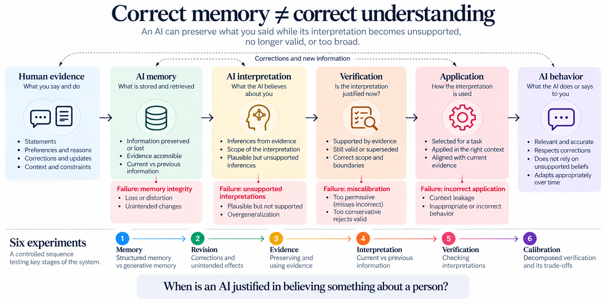

# Interpretation Correctability

**Six controlled experiments on memory integrity, interpretation, verification, and calibration in adaptive AI.**

> **Correct memory does not guarantee correct understanding.**  
> An AI can preserve what a person said while its interpretation becomes unsupported, no longer valid, or too broad.



## Why this repository exists

Adaptive AI systems increasingly retain information about people over time. That creates a problem beyond recall: even when the underlying human evidence is preserved, the system can form an interpretation that is unsupported, no longer current, too broad, or incorrectly applied.

This repository contains a controlled exploratory sequence of six experiments that progressively isolates that problem.

The work does **not** establish a universally superior memory architecture or a solved mechanism for personalization. It provides reproducible evidence of several failure modes and motivates a narrower research question:

> **When is an AI justified in believing something about a person?**

## What the six experiments found

| Experiment | Focus | Main observation |
|---|---|---|
| 1 | Memory | Repeated generative updating could alter or lose explicitly supplied information. |
| 2 | Revision | Atomic updates protected unrelated records, but relevant revisions could still distort meaning. |
| 3 | Evidence | Immutable evidence preserved a recovery path, but did not guarantee faithful reconstruction or behavior. |
| 4 | Interpretation | Evidence grounding rejected several unsupported beliefs, while still producing interpretation and application failures. |
| 5 | Verification | A verifier accepted all four deliberately corrupted interpretations as supported, so no repair occurred. |
| 6 | Calibration | Decomposition caught 8/8 corruptions but rejected 8/8 valid interpretations. Sensitivity improved while calibration collapsed. |

**Research progression:** `Memory -> Revision -> Evidence -> Interpretation -> Verification -> Calibration`

The cross-experiment result is not that one memory architecture wins. It is that **evidence integrity, interpretation integrity, contextual applicability, and behavioral fidelity can fail independently.**

## Start here

For the shortest independent replication, start with **Experiment 6**:

1. Open [`notebooks/experiment_6_decomposed_verification.ipynb`](notebooks/experiment_6_decomposed_verification.ipynb) in GitHub or [launch it in Google Colab](https://colab.research.google.com/github/GesaSchneider1/interpretation-correctability/blob/main/notebooks/experiment_6_decomposed_verification.ipynb).
2. Use a GPU runtime.
3. Run the notebook without changing the frozen cases or verifier prompts.
4. Compare your metrics with `results/experiment_6/original_results_archive.zip`.
5. Report both corruption detection and valid-personalization preservation.

The original run reported:

| Condition | Accuracy | Corruption detection | Valid personalization |
|---|---:|---:|---:|
| Holistic verifier | 13/16 (81.25%) | 5/8 (62.5%) | 8/8 (100%) |
| Decomposed verifier | 8/16 (50%) | 8/8 (100%) | 0/8 (0%) |

A verifier that rejects every interpretation is not a successful verifier.

See [`REPRODUCE.md`](REPRODUCE.md) for the full reproduction guide and [`PROTOCOL_AND_RESULTS.md`](PROTOCOL_AND_RESULTS.md) for the canonical experiment record.

## Repository structure

```text
interpretation_correctability_model.png
public_research_note.pdf
public_research_note.docx
internal_research_synthesis_v1.docx
notebooks/
  experiment_1_memory_integrity.ipynb
  experiment_1_benchmark.py
  experiment_2_atomic_revision.ipynb
  experiment_3_evidence_interpretation.ipynb
  experiment_4_interpretation_correctability.ipynb
  experiment_5_verification_recovery.ipynb
  experiment_6_decomposed_verification.ipynb
results/
  experiment_1/
  experiment_2/
  experiment_3/
  experiment_4/
  experiment_5/
  experiment_6/
PROTOCOL_AND_RESULTS.md
LIMITATIONS.md
REPRODUCE.md
CITATION.cff
requirements.txt
LICENSE
```

## Interpretation Correctability

This sequence motivates, but does not establish as a general capability, **Interpretation Correctability**:

> The ability of an adaptive AI to maintain useful inferences about a person while preserving the distinction between human-supplied evidence and machine-generated interpretation, and to detect, revise, or withdraw interpretations when they become unsupported, no longer valid, contradicted, or contextually inappropriate.

A useful conceptual separation is:

`Human evidence -> AI memory -> AI interpretation -> Verification -> Application -> AI behavior`

Each stage can fail independently.

## Claims discipline

This is a small controlled exploratory program using one synthetic user, a limited set of hand-designed cases, predominantly one open model family, and mostly deterministic single runs. Several early experiments contain implementation confounds. Experiment 5 contains a documented metadata deviation. Experiment 3's recovered raw-results archive is currently not extractable.

Please read [`LIMITATIONS.md`](LIMITATIONS.md) before citing broader conclusions.

## Research note

The concise public summary is available at [`public_research_note.pdf`](public_research_note.pdf).

## Independent replication

The most valuable next evidence is external. If you rerun Experiment 6 on another model, preserve the frozen cases and prompts and report both false acceptance and false rejection. A replication that contradicts these results is useful evidence too.

## Author and citation

**Gesa Schneider**, 2026.

If you reuse the test cases, experimental structure, or results, please cite this repository. A machine-readable citation template is provided in [`CITATION.cff`](CITATION.cff).

Code is released under the MIT License. Research text and figures should remain attributed to the author.
